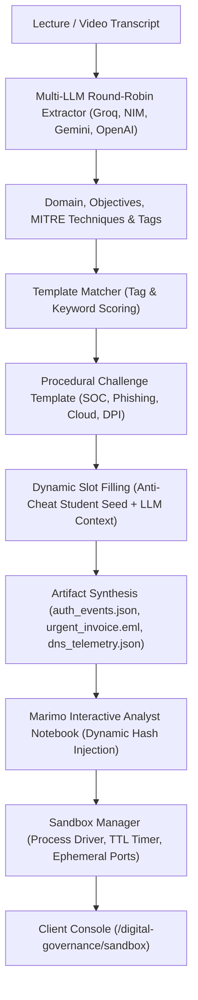

# Digital Governance, Cybersecurity Architecture & CTF Sandbox

> **Status:** `Active Implementation` (Branch: `cgp/digital-governance`)  
> **Lead Engineer:** Diwakar Ujjwal (@diwakarujjwal)  
> **Accrediting Authorities:** National e-Governance Division (NeGD) & Indian Computer Emergency Response Team (CERT-In), Ministry of Electronics & IT (MeitY)  
> **Primary Subsystems:**
>
> - Official Curriculum & In-Lesson Quizzes (`backend/app/core/seed_data.py`)
> - 15-Question Certification Examination (`backend/app/modules/assessments/`)
> - Multi-Stage Incident Response Tabletop Engine (`backend/app/modules/digital_governance/`)
> - TryHackMe/HTB-Style Dynamic CTF Sandbox & Marimo Execution (`backend/content/cybersec_challenges/`, `testing_marimo/`)

---

## 1. Executive Summary & Statutory Foundations

The **Digital Governance & Cybersecurity Ecosystem** on iGOT Karmayogi equips Indian civil servants, ministry IT coordinators, and public sector administrators with operational and regulatory mastery across the Government of India's digital frameworks.

The curriculum and evaluation engines strictly center on **5 Core National Pillars**:

1. **Cybersecurity**: Statutory cyber incident response and mandatory 6-hour reporting to CERT-In under Section 70B(6) of the Information Technology Act 2000; Critical Information Infrastructure (CII) protection administered by NCIIPC under Section 70A; live Security Operations Center (SOC) telemetry triage.
2. **Data Privacy**: Digital Personal Data Protection Act, 2023 (DPDP Act); statutory duties of Data Fiduciaries and Significant Data Fiduciaries (SDF); consent manager architecture; citizen rights (access, correction, erasure); Data Protection Board of India enforcement and penalty regimes (up to ₹250 crore).
3. **Digital Signatures & Public Key Infrastructure (PKI)**: IT Act 2000 Sections 3, 3A, and 5; apex oversight by the Controller of Certifying Authorities (CCA); Class 3 FIPS 140-2 Level 2 cryptographic hardware tokens; Aadhaar eSign in e-Office; evidentiary admissibility and non-repudiation under Section 65B of the Indian Evidence Act.
4. **Government Cloud (MeghRaj / GI Cloud)**: MeitY Cloud adoption guidelines; mandatory third-party technical security audits by the Standardisation Testing and Quality Certification (STQC) Directorate; sovereign data localization for primary and disaster recovery records; Government Community Cloud (GCC) isolation.
5. **Digital Public Infrastructure (DPI / India Stack)**: Population-scale digital platforms including Aadhaar authentication APIs and e-KYC 2.5; DigiLocker Rule 9A legal parity with physical documents; Public Financial Management System (PFMS) Direct Benefit Transfer (DBT) via the NPCI Aadhaar Payment Bridge (APB); inter-ministerial data exchange via API Setu / OpenForge.

---

## 2. Curriculum & Assessment Architecture (Milestone 1)

### 2.1 Course Specification

- **Title:** `Digital Governance, Cyber Defense & Public Digital Architecture`
- **Category:** `Digital Governance`
- **Organization:** `National e-Governance Division (NeGD) & CERT-In`
- **Target Audience:** Indian Administrative Service (IAS), Indian Statistical Service (ISS), Central Secretariat Service (CSS), and departmental IT nodal officers.
- **Duration:** 10.0 Hours | Intermediate Difficulty | 5 Modules | 10 Lessons.

### 2.2 In-Lesson Practice Activities (MCQs)

Every lesson embeds an authentic, civil-service-graded practice question within the `CourseLearningPlayerPage.tsx` interface:

- Immediate client-side validation against backend endpoint `POST /api/learning/lesson/{id}/activity`.
- Contextual regulatory feedback citing specific Acts, statutory rules, or circulars.
- Confetti celebration upon correct submission.

### 2.3 Comprehensive Certification Examination

Attached directly to the course via the core `Assessment` and `Question` schema:

- **Duration:** 30 minutes timed examination.
- **Passing Threshold:** 70.0% verified score.
- **15 Examination Questions:** 3 rigorous questions for each of the 5 pillars, testing statutory definitions, administrative protocols, and forensic triage.
- Fully compatible with `AssessmentTestPage.tsx` at `/assess/[assessmentId]`, offering detailed question analysis breakdowns and credential certificate generation.

---

## 3. Multi-Stage Incident Response Tabletop Engine (Milestone 2)

### 3.1 Overview & Simulation Mechanics

Located at `/digital-governance/scenarios` (backed by `backend/app/modules/digital_governance/`), the Tabletop Engine presents real-world crisis management simulations for government officers.

### 3.2 The 5 National Pillars & Scenario Catalog

1. **Cybersecurity (`dg-sec-01-ransomware-treasury`)**: _Operation Vajra_
   - Context: Active ransomware file encryption on State Treasury Payment Gateway (`TREASURY-DB-01`) at 02:15 AM before ₹180 crore pension release.
   - Core Statutory Decision: Network segmentation vs. hard power-off (preserving volatile memory under Section 65B of Indian Evidence Act); adherence to CERT-In's mandatory 6-hour incident reporting window under Section 70B(6) of IT Act 2000.
2. **Data Privacy (`dg-priv-02-dbt-cloud-breach`)**: _Operation Raksha_
   - Context: Unauthenticated public cloud storage bucket exposing 75,000 unredacted citizen bank records and Aadhaar numbers.
   - Core Statutory Decision: Immediate credential revocation; dual notification to the Data Protection Board of India and affected Data Principals under Section 8(6) of DPDP Act 2023; appointment of Data Protection Officer (DPO) and DPIA under Section 10.
3. **Digital Signatures & PKI (`dg-pki-03-gem-tender-dispute`)**: _Operation Mudra_
   - Context: Contractor disputes a ₹45 crore e-tender submitted via GeM with their Class 3 DSC token, claiming token theft.
   - Core Statutory Decision: Verification against CA OCSP responder and CRL revocation logs; non-repudiation enforcement under Sections 3, 3A, and 42 of IT Act 2000; Section 65B evidentiary certification for High Court defense.
4. **Government Cloud / MeghRaj (`dg-cloud-04-meghraj-sovereignty`)**: _Operation Megh_
   - Context: System integrator deploys automated containers into an unempaneled overseas data center to handle festival traffic spikes.
   - Core Statutory Decision: Emergency traffic cutoff and failover to domestic GCC; enforcement of STQC security auditing and MeitY empanelment; NIST SP 800-88 cryptographic sanitization verification.
5. **Digital Public Infrastructure / DPI (`dg-dpi-05-apisetu-replay-attack`)**: _Operation Setu_
   - Context: 65,000 requests/second replay attack against state scholarship e-KYC gateway.
   - Core Statutory Decision: Gateway-level cryptographic nonce verification and clock-skew tolerance (<300ms); adaptive token-bucket rate limiting per Virtual ID (VID); threat intelligence sharing with CERT-In and NCCC.

### 3.3 Interactive Client Player (`CyberScenariosPage.tsx`)

- **Pillar Filter Tabs**: Quick filtering across the 5 domains.
- **Dynamic Decision Nodes**: Step-by-step branching prompts with instant operational consequence callouts and statutory rationale citations.
- **Compliance Score Tracking**: Real-time scoring meter ($0–100\%$) rewarding statutory compliance and penalizing procedural infractions.
- **Executive Debrief Report**: Chronological decision trail, optimal vs sub-optimal breakdown, and printable compliance summary.

---

## 4. Cybersecurity Sandbox & CTF Pipeline Engine (Milestone 3)

### 4.1 Architecture Overview (TryHackMe / HackTheBox Paradigm)

Located at `/digital-governance/sandbox` (backed by `backend/app/modules/digital_governance/services/`), the Cybersecurity Sandbox provides hands-on digital forensics and threat hunting environments for civil servants.

Rather than static exercises, challenges are generated procedurally from lecture transcripts through human-authored templates filled by an LLM with randomized parameters (IPs, accounts, breach timestamps, and cryptographic flags).

### 4.2 Multi-LLM Round-Robin Provider (`services/llm_provider.py`)

- **Key Rotation**: Implements round-robin token rotation across multiple keys per provider to overcome rate limits.
- **Supported Providers**:
  - **Groq**: `llama-3.3-70b-versatile` (primary low-latency inference).
  - **NVIDIA NIM**: `meta/llama-3.1-70b-instruct` (enterprise fallback).
  - **Google Gemini**: `gemini-1.5-flash` / `gemini-2.0-flash`.
  - **OpenAI**: `gpt-4o-mini` / `gpt-4o`.
- **Failover Chain**: Groq $\to$ NIM $\to$ Gemini $\to$ OpenAI $\to$ Heuristic Fallback Engine.
- **Zero-Token Resilience**: Built-in civil defense heuristic parser ensures deterministic challenge generation even when no API keys are configured.

### 4.3 Full Catalog of 8 Procedural Challenge Templates (`services/templates/`)

All 8 challenges are stored with full evidence telemetry and interactive Marimo notebooks in the database:

1. **Module 1 (`01-soc-auth-investigation`)**: _Operation NightShift_ (SOC Investigation)
   - Telemetry: Windows Security Event logs (Event 4624 logon, 4625 brute-force, 4688 LOLBin certutil/bitsadmin execution).
   - Flag: `FLAG{<victim_user>_<lolbin>_<hash>}` discovered via post-exploitation process creation events.
2. **Module 2 (`02-phishing-dfir`)**: _Executive Spearphish & Invoice Fraud_ (DFIR / Phishing)
   - Telemetry: Raw RFC 822 `.eml` with SPF/DKIM authentication failures and internal DNS query telemetry with C2 callbacks.
   - Flag: `FLAG{dmarc_fail_<domain>_<hash>}` correlated via anomalous C2 DNS queries.
3. **Module 3 (`03-compromised-linux-server`)**: _Operation Shakti_ (Incident Response / Linux Forensics)
   - Telemetry: `auth.log`, `crontab.txt`, `backup_sync.sh`, and `bash_history` detailing sudoers privilege escalation and malicious cron persistence.
   - Flag: `FLAG{crontab_reverse_shell_persisted_<user>_<hash>}` discovered by auditing cron tasks and de-obfuscating bash reverse shells.
4. **Module 4 (`04-vulnerable-web-app`)**: _Operation Suraksha_ (Web Application Security / Data Privacy)
   - Telemetry: `corp_directory.db` (SQLite citizen registry) with UNION-based SQL injection vulnerability on citizen welfare queries.
   - Flag: `FLAG{sqli_union_citizen_leak_<hash>}` recovered from unredacted citizen subsidy records violating the DPDP Act 2023.
5. **Module 5 (`05-threat-hunting-lotl`)**: _Operation Garuda_ (CII Threat Hunting / Cyber Defense)
   - Telemetry: Sysmon process creation logs (`sysmon_events.json`) and DNS queries (`dns_events.json`) with Shannon entropy analysis.
   - Flag: `FLAG{dns_tunneling_entropy_exfil_<hash>}` recovered by isolating masqueraded LOLBin execution and Base64 DNS tunneling.
6. **Module 6 (`06-pki-token-dispute`)**: _Operation Mudra_ (Digital Signatures / PKI)
   - Telemetry: `gem_tender_submission.json` and `crl_revocation_list.json` analyzing GeM e-tender submission timestamps vs. CA revocation lists.
   - Flag: `FLAG{pki_non_repudiation_valid_<hash>}` validating non-repudiation under IT Act 2000 Section 3, 3A, and 42.
7. **Module 7 (`07-meghraj-cloud-audit`)**: _Operation Megh_ (Government Cloud / MeghRaj)
   - Telemetry: Cloud audit event logs (`cloud_audit_events.json`) identifying unauthorized container migrations to foreign unempaneled regions.
   - Flag: `FLAG{meghraj_sovereign_unapproved_<region>_<hash>}` recovered from STQC audit remediation telemetry.
8. **Module 8 (`08-dpi-apisetu-replay`)**: _Operation Setu_ (Digital Public Infrastructure / DPI)
   - Telemetry: API Setu gateway access telemetry (`apisetu_gateway_logs.json`) with duplicate cryptographic nonces and timestamp skews.
   - Flag: `FLAG{apisetu_replay_blocked_<nonce>_<hash>}` recovered from WAF rate-limiting mitigation tokens.

### 4.4 Database Persistence Architecture (Zero Git Sprawl)

- **SQLAlchemy Schema**: Challenge definitions, telemetry artifacts (`artifacts_json`), and Marimo `notebook_code` reside directly in `cyber_sandbox_challenges`. The old static `backend/content/` directory has been completely deleted.
- **Ephemeral Materialization**: When an officer launches a session, evidence files and notebooks are materialized on demand into `backend/scratch/sandboxes/<session_id>/` (gitignored) and purged on termination.
- **Session Tracking**: Active sessions are persisted in `cyber_sandbox_sessions` with dynamic anti-cheat flags and hint penalties.
- **Competency Accounting**: Verified flag submissions award competency points across the 5 pillars in `user_cyber_competencies`.

### 4.5 Live Supabase Digital Governance Knowledge Base (Strictly Read-Only GET)

- Connects directly to the live Supabase database (`tdcrpjlpvkqjptvsndnp.supabase.co`) using read-only `GET` queries.
- Ingests scraped Wikipedia articles and YouTube curricula across the 5 official domains: `cybersecurity`, `data-privacy`, `digital-signatures`, `government-cloud`, and `digital-public-infrastructure`.
- Exposed via `GET /api/digital-governance/sandbox/knowledge-base` and `POST /api/digital-governance/sandbox/generate-from-topic`.

---

## 5. Verification & Testing

- **Backend Unit Tests (`backend/tests/test_digital_governance.py`)**: 4 tests passing (curriculum, in-lesson activities, 15 certification questions, skills linkage).
- **Tabletop Scenarios Tests (`backend/tests/test_scenarios.py`)**: 4 tests passing (5 domains, branching lifecycle, penalty deductions, executive debrief).
- **Cybersecurity Sandbox Tests (`backend/tests/test_sandbox.py`)**: 7 tests passing:
  - Multi-LLM provider initialization and failover.
  - All 8 procedural templates registered and resolvable.
  - Tag and keyword matching across all governance domains.
  - Database seeding and challenge listing from `cyber_sandbox_challenges`.
  - Session lifecycle with DB materialization, hint unlocking, flag verification, and shutdown.
  - ContentGenerationPipeline transcript compilation and database persistence.
  - Supabase read-only knowledge base retrieval across the 5 pillars.
- **Frontend Verification**:
  - `npx tsc --noEmit` passed with 0 errors.
  - `npm run build` compiled all 20 pages successfully.
